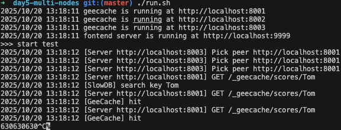
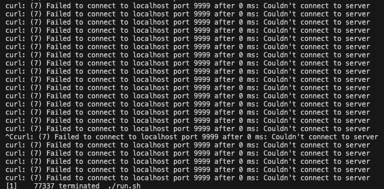
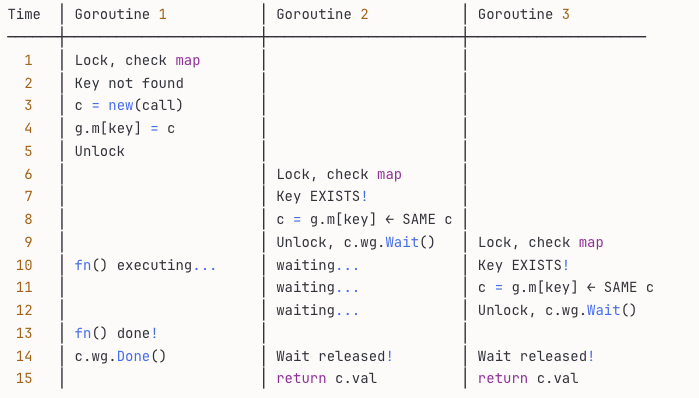

# Distributed Caching System in Go

This project is a distributed caching system built in Go, inspired by Google's GroupCache. It is designed to be high-performance, fault-tolerant, and resilient against common caching issues like cache stampedes.
```bash
┌─────────────────────────────────────────────────────────────┐
│                    CLIENT (curl/browser)                     │
└────────────────────────────┬────────────────────────────────┘
                             │ HTTP Request
                             ▼
┌─────────────────────────────────────────────────────────────┐
│           API Server (Frontend) - Port 9999                  │
│              http://localhost:9999/api?key=Tom               │
└────────────────────────────┬────────────────────────────────┘
                             │ gee.Get("Tom")
                             ▼
┌─────────────────────────────────────────────────────────────┐
│                    GeeCache Group (Logic Layer)              │
│                  Handles: routing, singleflight              │
└──────┬──────────────────────────────┬───────────────────────┘
       │                              │
       │ Local cache hit?             │ Cache miss?
       ▼                              ▼
┌─────────────────┐        ┌──────────────────────────────────┐
│  Local LRU      │        │    Peer Discovery                 │
│  mainCache      │        │    (Consistent Hashing)           │
│  (in-memory)    │        └──────────┬───────────────────────┘
└─────────────────┘                   │
                                      │ Which peer owns key?
                                      ▼
                        ┌─────────────────────────────┐
                        │  Do I own this key?         │
                        └─────────┬───────────┬───────┘
                                  │           │
                    YES: Load local │         │ NO: Fetch from peer
                                  ▼           ▼
                        ┌──────────────┐  ┌─────────────────────┐
                        │  Getter      │  │  HTTP GET to Peer   │
                        │  (SlowDB)    │  │  e.g., Node 8001    │
                        │  db[key]     │  └─────────────────────┘
                        └──────────────┘
                             │
                             │ In-memory map
                             ▼
                    ┌─────────────────────┐
                    │  var db = map[...]  │
                    │  Tom:  "630"        │
                    │  Jack: "589"        │
                    │  Sam:  "567"        │
                    └─────────────────────┘

```
## Features

*   **LRU Cache**: A core in-memory LRU (Least Recently Used) cache for efficient key eviction.
*   **Distributed Nodes**: The cache is distributed across multiple nodes, with each node responsible for a portion of the keys.
*   **Consistent Hashing**: Uses a consistent hashing algorithm to map keys to nodes, ensuring minimal data redistribution when nodes are added or removed.
*   **Cache Stampede Prevention**: Implements the `single-flight` pattern to prevent the "thundering herd" problem (cache breakdown) where multiple requests for the same uncached key overwhelm the backend data source.
*   **Peer-to-Peer Communication**: Nodes communicate directly with each other over HTTP to retrieve data owned by other peers.

---

## Core Concepts & Data Structures

### 1. LRU Cache

The foundation of each cache node is a thread-safe LRU cache. It uses a standard combination of a hash map and a doubly-linked list to achieve O(1) time complexity for both `Get` and `Add` operations.

*   `map[string]*list.Element`: Provides direct access to cache entries.
*   `list.List`: A doubly-linked list that maintains the order of access. The most recently used item is moved to the front, and the least recently used item is at the back, ready for eviction.


### 2. Consistent Hashing


```bash
Time │ Request 1       │ Request 2       │ Request 3       │ ... │ Request 100
─────┼─────────────────┼─────────────────┼─────────────────┼─────┼──────────────
  1  │ Check cache     │ Check cache     │ Check cache     │     │ Check cache
  2  │ ❌ MISS         │ ❌ MISS         │ ❌ MISS         │     │ ❌ MISS
  3  │ Query DB 🔥     │ Query DB 🔥     │ Query DB 🔥     │     │ Query DB 🔥
  4  │ DB processing   │ DB processing   │ DB processing   │     │ DB processing
  5  │ Get result      │ Get result      │ Get result      │     │ Get result
  6  │ Set cache       │ Set cache       │ Set cache       │     │ Set cache

```

**Problem**: 100 identical DB queries executed simultaneously! 💥
```
         ┌─────────────┐
         │   Cache     │
         │  (expired)  │
         └─────────────┘
                │
                │ 100 requests miss cache
                ↓
         ┌─────────────┐
         │  Database   │ ← 💥 100 concurrent queries!
         │  OVERLOAD!  │
         └─────────────┘
```

---

## **✅ WITH Singleflight (Problem Solved!)**
```
Time │ Request 1          │ Request 2          │ Request 3          │ ... │ Request 100
─────┼────────────────────┼────────────────────┼────────────────────┼─────┼─────────────────
  1  │ Check cache        │ Check cache        │ Check cache        │     │ Check cache
  2  │ ❌ MISS            │ ❌ MISS            │ ❌ MISS            │     │ ❌ MISS
  3  │ g.mu.Lock()        │ g.mu.Lock() ⏳     │ g.mu.Lock() ⏳     │     │ g.mu.Lock() ⏳
  4  │ g.m[key] NOT found │ (blocked...)       │ (blocked...)       │     │ (blocked...)
  5  │ c = new(call)      │                    │                    │     │
  6  │ g.m[key] = c       │                    │                    │     │
  7  │ g.mu.Unlock()      │                    │                    │     │
  8  │ Query DB 🔥        │ g.mu.Lock()        │ g.mu.Lock() ⏳     │     │ g.mu.Lock() ⏳
  9  │ DB processing...   │ g.m[key] FOUND! ✓  │ (blocked...)       │     │ (blocked...)
 10  │                    │ c.wg.Wait() ⏳     │                    │     │
 11  │                    │ (waiting...)       │ g.mu.Lock()        │     │ g.mu.Lock() ⏳
 12  │                    │                    │ g.m[key] FOUND! ✓  │     │
 13  │                    │                    │ c.wg.Wait() ⏳     │     │
 14  │ Get result ✓       │                    │ (waiting...)       │     │ (waiting...)
 15  │ c.wg.Done()        │ (unblocked!)       │ (unblocked!)       │     │ (unblocked!)
 16  │                    │ return result      │ return result      │     │ return result
```

**Result**: Only **1 DB query** for 100 requests! 🎉
```
         ┌─────────────┐
         │   Cache     │
         │  (expired)  │
         └─────────────┘
                │
                │ 100 requests miss cache
                ↓
         ┌─────────────┐
         │ Singleflight│
         │   Group     │ ← Deduplicates to 1 request
         └─────────────┘
                │
                │ Only 1 query!
                ↓
         ┌─────────────┐
         │  Database   │ ← 😊 Happy!
         │    (OK)     │
         └─────────────┘
```

---

## **Detailed Flow Chart**
```
Request comes in
      │
      ↓
┌──────────────┐
│ Check Cache  │
└──────────────┘
      │
      ↓
  Cache Hit? ────Yes───→ Return cached value
      │
      No
      ↓
┌──────────────────────┐
│  g.mu.Lock()         │  ← CRITICAL SECTION
│  Check g.m[key]      │
└──────────────────────┘
      │
      ↓
   Key exists in g.m?
      │
      ├─────Yes─────→ ┌──────────────────┐
      │               │ g.mu.Unlock()    │
      │               │ c.wg.Wait()      │ ← Wait for first request
      │               │ return c.val     │
      │               └──────────────────┘
      │
      No (I'm first!)
      ↓
┌──────────────────────┐
│ c = new(call)        │
│ c.wg.Add(1)          │
│ g.m[key] = c         │  ← Register myself
│ g.mu.Unlock()        │
└──────────────────────┘
      │
      ↓
┌──────────────────────┐
│ Query Database       │  ← Only first request does this
│ c.val = result       │
│ c.wg.Done()          │  ← Unblock all waiters
└──────────────────────┘
      │
      ↓
┌──────────────────────┐
│ delete(g.m, key)     │  ← Cleanup
│ return result        │
└──────────────────────┘
```

---

## **Comparison Chart**

| Metric | Without Singleflight | With Singleflight |
|--------|---------------------|-------------------|
| **DB Queries** | 100 | 1 |
| **DB Load** | 💥 Overload | 😊 Normal |
| **Response Time** | Slow (DB overwhelmed) | Fast (only 1 query) |
| **Cache Breakdown** | ❌ Happens | ✅ Prevented |

---


maps keys to a space of 2^32, connecting the beginning and end of this number range to form a ring. When adding or deleting nodes, only a small portion of data near that node needs to be relocated, rather than needing to relocate all the data. This solves the * cache avalanche  and cache skew problem *.

- Calculate the hash value of nodes/machines (typically using the node's name, number, and IP address) and place them on the ring.
- Calculate the hash value of the key and place it on the ring. Moving clockwise, the first node encountered is the node/machine that should be selected.

To distribute keys across multiple nodes without causing a massive reshuffle when the cluster size changes, we use a consistent hashing algorithm.

*   **Hash Ring**: All cache nodes (peers) are mapped onto a virtual hash ring.
*   **Virtual Nodes**: To ensure a more uniform distribution of keys, each real node is represented by multiple "virtual nodes" on the ring.
*   **Key Mapping**: To find which node owns a key, we hash the key and find the first node that appears clockwise on the ring.

This approach ensures that when a node is added or removed, only a small fraction of keys need to be remapped.


#### cache breakdown problem
- when test for 3 curl, becuase of hash function, all request calling 8001 host

- when test for 100, 000, it caused cache breakdown problem


### 3. Single-Flight Execution

The `singleflight` pattern is a crucial optimization to prevent cache breakdown (also known as a cache stampede or thundering herd).

A cache breakdown occurs when a popular, uncached item is requested by thousands of clients simultaneously. All these requests miss the cache and hit the backend database at the same time, potentially causing it to crash.

The `singleflight` group ensures that for any given key, only **one** request is sent to the backend data source (or a remote peer). All other concurrent requests for the same key will wait for the first one to complete and will then share its result. This effectively coalesces multiple identical requests into a single one.

---

## The Cache Breakdown Problem & Solution

In a high-concurrency environment, if a cached value expires or is not yet present, multiple requests can simultaneously miss the cache and proceed to query the slow backend database for the same data.

**Without `singleflight`**, our system would suffer from this problem, leading to redundant database queries as shown below. Each `[SlowDB] search key` log represents a database hit.

```
2025/10/20 13:25:21 [SlowDB] search key Tom
2025/10/20 13:25:21 [GeeCache] hit
2025/10/20 13:25:21 [SlowDB] search key Tom
630630630
```

**With `singleflight`**, the system is protected. The first request triggers the database lookup, while subsequent requests for the same key wait and share the result. This results in only one database hit, significantly reducing the load on the backend.

```
2025/10/20 13:18:12 [Server http://localhost:8003] Pick peer http://localhost:8001
2025/10/20 13:18:12 [Server http://localhost:8001] GET /_geecache/scores/Tom
2025/10/20 13:18:12 [SlowDB] search key Tom
2025/10/20 13:18:12 [GeeCache] hit
2025/10/20 13:18:12 [GeeCache] hit
630630630
```

---

## Project Structure

```
Distributed-Caching-Optimization/
├── consistenthash/
│   └── consistenthash.go   # Consistent hashing implementation
├── lru/
│   └── lru.go          # Core LRU cache data structure
── singleflight/
│   └── singleflight.go # Request coalescing logic
├── geecache/  
│   ├── byteview.go         # Read-only byte view for cache values
│   ├── cache.go            # Thread-safe wrapper for the LRU cache
│   ├── geecache.go         # Main group logic and peer interaction
│   └── http.go             # HTTP server for peer-to-peer communication
├── main.go                 # Main application to start servers
└── run.sh                  # Script to build and run a demo cluster
```

## How to Run

1.  **Build the application**:
    ```bash
    go build -o server
    ```
2.  **Run the cluster**:
    The `run.sh` script starts three cache nodes on ports `8001`, `8002`, and `8003`, along with a frontend API server on port `9999`.
    ```bash
    ./run.sh
    ```
3.  **Test the API**:
    You can now query the cache via the API server.
    ```bash
    # This will either hit the cache or fetch from the slow DB
    $ curl "http://localhost:9999/api?key=Tom"
    630

    # This key does not exist in the DB
    $ curl "http://localhost:9999/api?key=unknown"
    unknown not exist
    ```

## Final Service
```
┌────────────────────────────────────────────────────────────┐
│  BEST USE CASES                                            │
├────────────────────────────────────────────────────────────┤
│                                                            │
│  1️⃣  REAL-TIME LEADERBOARDS / SCORES                      │
│  ─────────────────────────────────────                    │
│  • Gaming platforms (millions of players)                 │
│  • Sports apps (live rankings)                            │
│  • Fitness trackers (activity feeds)                      │
│                                                            │
│  Why ideal:                                                │
│  ✅ Hot data (leaderboard queries 1000s/sec)              │
│  ✅ Consistent hashing fits {userId: score}               │
│  ✅ Singleflight prevents DB hammer on popular players    │
│  ✅ Frequent updates (invalidation via Kafka)             │
│  ✅ High tolerance for eventual consistency (~100ms)      │
│                                                            │
│  Example Load:                                             │
│  - 100k daily users, 50k concurrent                       │
│  - 500k score lookups/hour                                │
│  - Your system: 💰 $5k/month (vs $50k for managed cache) │
│                                                            │
│ ──────────────────────────────────────────────────────────│
│                                                            │
│  2️⃣  E-COMMERCE PRODUCT CATALOGS                          │
│  ─────────────────────────────────────                    │
│  • Shopping carts (1-2k RPS)                              │
│  • Product metadata (descriptions, prices)                │
│  • Inventory counts (frequently updated)                  │
│                                                            │
│  Why ideal:                                                │
│  ✅ Medium-hot data (millions of SKUs, subset cached)     │
│  ✅ Singleflight prevents thundering herd on flash sales  │
│  ✅ Multi-AZ ensures uptime (cart never goes down)        │
│  ✅ Raft handles distributed cart replica sync            │
│                                                            │
│  Example Load:                                             │
│  - 10M SKUs, 10k hot items                                │
│  - 5k concurrent users in cart                            │
│  - Your system: 💰 $8k/month                              │
│                                                            │
│ ──────────────────────────────────────────────────────────│
│                                                            │
│  3️⃣  API RATE LIMITING / QUOTA TRACKING                   │
│  ─────────────────────────────────────                    │
│  • API gateway (track per-user rate limits)               │
│  • SaaS metering (API calls per subscription tier)        │
│  • DDoS protection (track request IPs)                    │
│                                                            │
│  Why ideal:                                                │
│  ✅ Requires instant cross-node consistency               │
│  ✅ High throughput (millions of quota checks/sec)        │
│  ✅ Raft ensures no double-counting across nodes          │
│  ✅ Sub-millisecond latency critical                      │
│                                                            │
│  Example Load:                                             │
│  - 10k API clients making 100 req/sec each                │
│  - 1M quota checks/sec                                    │
│  - Your system: 💰 $6k/month (vs $100k+ for managed)    │
│                                                            │
│ ──────────────────────────────────────────────────────────│
│                                                            │
│  4️⃣  SESSION STORAGE (User Login State)                   │
│  ─────────────────────────────────────                    │
│  • User authentication tokens                             │
│  • Login sessions (device fingerprints)                   │
│  • 2FA state (temporary codes)                            │
│                                                            │
│  Why ideal:                                                │
│  ✅ Medium lifespan (hours → days)                        │
│  ✅ Must survive node failures (Raft quorum)              │
│  ✅ High availability (concurrent logins spike)           │
│  ✅ Cost-effective (vs. Redis Enterprise)                 │
│                                                            │
│  Example Load:                                             │
│  - 100M registered users, 5% active                       │
│  - 5M session lookups/hour                                │
│  - Your system: 💰 $4k/month                              │
│                                                            │
│ ──────────────────────────────────────────────────────────│
│                                                            │
│  5️⃣  DISTRIBUTED FEATURE FLAGS / CONFIG                   │
│  ─────────────────────────────────────────                │
│  • A/B test assignments (consistent per user)             │
│  • Feature flags (canary rollouts)                        │
│  • Regional config (serve different content)              │
│                                                            │
│  Why ideal:                                                │
│  ✅ Consistent hashing = same user always gets same flag  │
│  ✅ Quick updates (Kafka invalidation)                    │
│  ✅ Raft ensures no conflicting assignments               │
│  ✅ Scales to billions of feature flag evals              │
│                                                            │
│  Example Load:                                             │
│  - 1B monthly active users                                │
│  - 50k feature flag lookups/sec                           │
│  - Your system: 💰 $12k/month (vs $200k+ LaunchDarkly)  │
│                                                            │
│ ──────────────────────────────────────────────────────────│
│                                                            │
│  6️⃣  RECOMMENDATION ENGINE CACHE                          │
│  ─────────────────────────────────────                    │
│  • ML model predictions (user embeddings)                 │
│  • Candidate items (pre-computed top-N)                   │
│  • Personalization state                                  │
│                                                            │
│  Why ideal:                                                │
│  ✅ Cache predictions (not recompute ML every request)    │
│  ✅ Consistent hashing = same user → same recommendations │
│  ✅ Singleflight prevents model overload                  │
│  ✅ High-performance serving (sub-10ms)                   │
│                                                            │
│  Example Load:                                             │
│  - 50M monthly users                                      │
│  - 100 candidate items / user (500M cached items)         │
│  - 10k recommendation requests/sec                        │
│  - Your system: 💰 $10k/month (core recommendation tier) │
│                                                            │
└────────────────────────────────────────────────────────────┘

                          ┌─────────────────┐
                          │ Shoppers (Global)│
                          └────────┬─────────┘
                                   │
                    ┌──────────────┴──────────────┐
                    │  AWS CloudFront (CDN)       │
                    │  (Static assets, origin)    │
                    └──────────────┬──────────────┘
                                   │
                ┌──────────────────┴──────────────────┐
                │  Application Load Balancer (HTTPS)  │
                │  (geecache.shop.com:443)            │
                └──────────────┬───────────────────────┘
                               │
        ┌──────────────────────┼──────────────────────┐
        │                      │                      │
        ▼                      ▼                      ▼
    ┌────────┐            ┌────────┐            ┌────────┐
    │ API    │            │ API    │            │ API    │
    │Frontend│            │Frontend│            │Frontend│
    │ (2-50  │            │ (2-50  │            │ (2-50  │
    │ Fargate│            │ Fargate│            │ Fargate│
    │ tasks) │            │ tasks) │            │ tasks) │
    │        │            │        │            │        │
    │ Port   │            │ Port   │            │ Port   │
    │ 9999   │            │ 9999   │            │ 9999   │
    └────┬───┘            └────┬───┘            └────┬───┘
         │ gRPC               │ gRPC               │ gRPC
         │ (port 8001)        │ (port 8001)        │ (port 8001)
         │                    │                    │
         ▼                    ▼                    ▼
    ┌─────────────────────────────────────────────────────┐
    │       GEECACHE CLUSTER (3-12 stateful nodes)        │
    │                                                      │
    │  Raft Consensus (port 7000):                        │
    │  ├── Leader election                                │
    │  ├── Hash ring state agreement                      │
    │  └── Cluster membership                             │
    │                                                      │
    │  Consistent Hash Ring:                              │
    │  ├── {product_id → node}                            │
    │  ├── {user_id → node}                               │
    │  ├── {session_id → node}                            │
    │  └── Virtual nodes (150 per real node)              │
    │                                                      │
    │  LRU Cache (In-Memory):                             │
    │  ├── 4GB per node × 6 nodes = 24GB total            │
    │  ├── Eviction: LRU when full                        │
    │  └── Hit rate: ~92% on hot products                 │
    │                                                      │
    │  Singleflight (Request Coalescing):                 │
    │  ├── Cache miss for "Nike Shoes" → 1 DB query      │
    │  ├── 1000 concurrent requests → wait for 1          │
    │  └── DB load: 99% reduction ✅                      │
    │                                                      │
    └──────────┬────────────────────────┬──────────────┬──┘
               │                        │              │
               │ Cache miss            │ Cache miss    │ Cache miss
               │ (8%)                  │ (8%)          │ (8%)
               ▼                        ▼              ▼
    ┌─────────────────────────────────────────────────────┐
    │  RDS PostgreSQL (Multi-AZ)                          │
    │                                                      │
    │  Primary (us-east-1a):                              │
    │  ├── products table (100M rows)                      │
    │  ├── prices (real-time)                             │
    │  ├── inventory (live counts)                        │
    │  └── Receives ~4000 queries/sec (8% misses)        │
    │                                                      │
    │  Standby (us-east-1b):                              │
    │  ├── Sync replication                               │
    │  └── Auto-failover (<30s)                           │
    │                                                      │
    │  Read Replicas (optional):                          │
    │  ├── Analytics queries (non-critical)              │
    │  └── Defer from primary                             │
    │                                                      │
    └─────────────────────────────────────────────────────┘

    Optional: Kafka KRaft (Phase 4)
    ┌──────────────────────────────────┐
    │ Topic: product-updates           │
    │ ├── When price changes: publish  │
    │ ├── Cache nodes: consume & evict │
    │ └── Result: Faster invalidation  │
    └──────────────────────────────────┘

    Observability (Prometheus + Grafana)
    ┌──────────────────────────────────┐
    │ Dashboard: e-commerce.grafana    │
    ├── Cache hit rate: 92%            │
    ├── P99 latency: 45ms              │
    ├── DB qps: 4000                   │
    ├── RPS: 50,000                    │
    └── Cost: $15k/month               │
    └──────────────────────────────────┘
```
## Not good for
```
┌────────────────────────────────────────────────────────────┐
│  DON'T USE THIS CACHE FOR:                                 │
├────────────────────────────────────────────────────────────┤
│                                                            │
│  ❌ Time-Series Data (metrics, logs)                       │
│     Why: Raft quorum slows down high-write workloads      │
│     Use: InfluxDB, Prometheus instead                     │
│                                                            │
│  ❌ Full-Text Search (search indexes)                      │
│     Why: Not designed for complex queries                 │
│     Use: Elasticsearch, Opensearch                        │
│                                                            │
│  ❌ Large Objects (images, videos)                         │
│     Why: LRU cache limited to GB, not TB                  │
│     Use: S3, CDN (CloudFront)                             │
│                                                            │
│  ❌ Persistent Data Warehouse (analytics)                  │
│     Why: Cache evicts old data, not designed for OLAP    │
│     Use: Redshift, BigQuery, Snowflake                    │
│                                                            │
│  ❌ Message Queue (job processing)                         │
│     Why: Cache doesn't guarantee durability or ordering  │
│     Use: Kafka, SQS, RabbitMQ                             │
│                                                            │
│  ❌ Geo-distributed Replication (multi-region)             │
│     Why: Raft requires low-latency quorum (same region)  │
│     Use: Multi-master replication (CockroachDB)           │
│                                                            │
│  ❌ Super-Hot Real-Time Data (<1ms latency required)       │
│     Why: Network round-trip + Raft consensus adds latency │
│     Use: In-process cache, local memory                   │
│                                                            │
└────────────────────────────────────────────────────────────┘
```

## The Clean Separation
```
┌─────────────────────────────────────────────────────────────┐
│           RAFT (Distributed Consensus)                      │
├─────────────────────────────────────────────────────────────┤
│                                                             │
│ Small coordination problem:                                │
│ • 3-12 nodes agreeing on hash ring                         │
│ • Who's leader? (not the data)                             │
│ • Lightweight messages (KB not GB)                         │
│ • Quorum: majority (can lose 1 node)                       │
│                                                             │
│ RAFT DOES: ✅ Consensus on membership & config             │
│                                                             │
└─────────────────────────────────────────────────────────────┘

                          ↓↑ (gRPC)

┌─────────────────────────────────────────────────────────────┐
│         AWS INFRASTRUCTURE (Everything Else)                │
├─────────────────────────────────────────────────────────────┤
│                                                             │
│ The "boring" stuff that's hard to build:                   │
│ • Network isolation (VPC, subnets, security groups)        │
│ • Load balancing (route traffic fairly)                    │
│ • Auto-scaling (spin up/down instances)                    │
│ • Persistent storage (RDS databases)                       │
│ • Monitoring & alerting (CloudWatch, alarms)               │
│ • Cost tracking (bill by the hour)                         │
│ • Multi-AZ resilience (data replication)                   │
│ • Backups & disaster recovery                              │
│ • SSL/TLS security (encrypt traffic)                       │
│                                                             │
│ AWS DOES: ✅ All the infrastructure so you don't have to  │
│                                                             │
└─────────────────────────────────────────────────────────────┘
```

