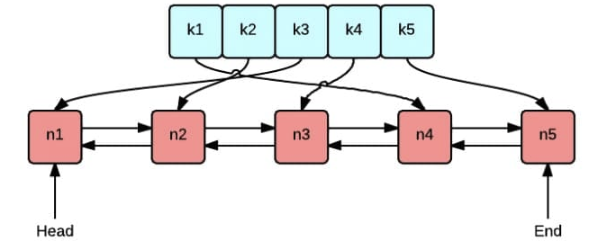
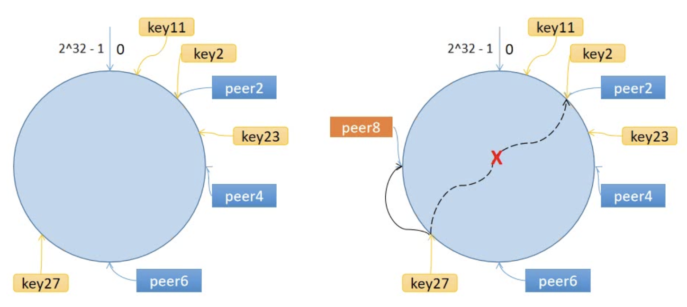

# Distributed-Caching-Optimization
# LRU cache


```bash
geecache/
    |--lru/
        |--lru.go  // lru cache
    |--byteview.go // cache value abstruction
    |--cache.go    // concurrency control
    |--geecache.go // interact with user, control cache value get and put
```
- byteview.go: Abstracted a read-only data structure ByteView to represent cache values
- cache.go: Encapsulating several methods of LRU with sync.Mutex

# Consistent Hashing Algorithm

maps keys to a space of 2^32, connecting the beginning and end of this number range to form a ring. When adding or deleting nodes, only a small portion of data near that node needs to be relocated, rather than needing to relocate all the data. This solves the * cache avalanche  and cache skew problem *.

- Calculate the hash value of nodes/machines (typically using the node's name, number, and IP address) and place them on the ring.
- Calculate the hash value of the key and place it on the ring. Moving clockwise, the first node encountered is the node/machine that should be selected.

# Distributed Nodes
